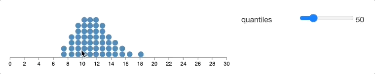
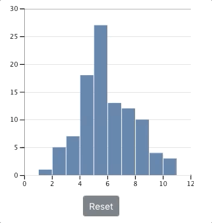

```{r meta, echo=FALSE, include=FALSE}
library(metathis)
meta() %>%
  meta_general(
    description = "Uncertainty visualizations for improving data science decision-making",
    generator = "xaringan and remark.js"
  ) %>% 
  meta_name("github-repo" = "wesslen/uncc-uncertainty") %>% 
  meta_social(
    title = "Uncertainty visualizations for improving data science decision-making",
    url = "uncc-uncertainty.netlify.app",
    #image = "https://pkg.garrickadenbuie.com/drake-intro/assets/images/drake-intro-cover.jpg",
    #image_alt = "The first slide of the Reproducible Data Workflows with drake presentation, featuring the drake hex logo and neatly ordered row of items on a desk (eraser, pencil, coffee cup, paperclips).",
    og_type = "website",
    og_author = "Ryan Wesslen",
    twitter_card_type = "summary_large_image",
    twitter_creator = "@ryanwesslen"
  )
```


```{r xaringanExtra-freezeframe, echo=FALSE}
xaringanExtra::use_freezeframe()
xaringanExtra::use_tachyons()
xaringanExtra::use_scribble()
```

```{r xaringan-themer, include = FALSE}
#devtools::install_github("gadenbuie/xaringanthemer")
#devtools::install_github("ropenscilabs/icon")
library(xaringanthemer); library(tidyverse); library(vembedr); library(xaringanExtra)
xaringan::summon_remark(to = "libs")
style_mono_accent(base_color = "#43418A")

#options(htmltools.preserve.raw = FALSE)
extra_css <- list(
  ".red"   = list(color = "red"),
  ".small" = list("font-size" = "70%"),
  ".large" = list("font-size" = "120%"),
  ".xlarge" = list(
    "font-size" = "250%",
    "vertical-align" = "middle" ),
  ".full-width" = list(
    display = "flex",
    width   = "100%",
    flex    = "1 1 auto"
  ),
  ".remark-slide-content:after" = list(
    "content" = "'bit.ly/vis-uncertainty'",
    "position" = "absolute",
    "font-size" = "0.8em",
    "bottom" = "5px",
    "right" = "10px",
    "height" = "40px",
    "width" = "250px"
  ),
  ".remark-slide-number" = list(
    "color" = "#FFFFFF", 
    "opacity" = "1" 
  )
)


# <style type="text/css">
# .remark-slide-content {
#     font-size: 20px;
#     padding: 1em 4em 1em 4em;
# }
# </style>

#write_extra_css(css = extra_css, outfile = "custom.css")
```

```{r setup, include=FALSE}
options(htmltools.dir.version = FALSE)
knitr::opts_chunk$set(warning = FALSE, message = FALSE, 
  comment = NA, dpi = 300, echo = FALSE,
  fig.align = "center", out.width = "80%", cache = TRUE)
```


# About Me 


#### Day job: Bank of America

* Manage natural lanuage processing (NLP) team

* Chief Data Scientist Organization, Enterprise Data & Strategy Governance

--

#### This presentation: UNCC Ribarsky Center, School of Data Science

* Last 5 years research group of 16+ UNCC faculty/students 

* 18 publications in human-computer interaction, visual analytics, information visualization, computational social science, cognitive science, psychology

* Collaborators: Wenwen Dou, Alireza Karduni, and Doug Markant


--

"The views expressed herein are those of the presenter; they do not necessarily reflect the views of author's employer or any other group or individual."

--

<p align="right">This presentation is available at this url</p>

???

[wesslen.netlify.app](wesslen.netlify.app)

---
# Uncertainty

class: center, middle


???

From COVID-19 to gamestop stocks to suez canal

* these unexpected events foster uncertainty

---

class: center, middle, inverse

# Why does data science frequently ignore uncertainty?

---

# Thesis

The fields of human-computer interaction and information visualizations

* probabilities are hard => frequency framing 

* classic statistics (e.g., p values) are confusing => bootstrapping with hops

* we learn => Bayesian analysis

---

class: center, middle, inverse

# Probabilities are hard

---


Uncertainty

* Knightian Uncertainty

* Entropy / information theory

* Frequentist: p-value, NHST

---

Decision-making: "choice between two or more competing courses of action" (Balleine, 2007 and Padilla et al., 2020)

argument: rise of visualization / hci best way to communicate uncertainty in data science (see padilla et al)

Choose dual-process framework: type 1 and type 2

---

Lead to common errors

* Frequency framing

* Cognitive categories

* anchoring

---

# Frequency framing


[What Do Vaccine Efficacy
Numbers Actually Mean?
By Carl Zimmer and Keith Collins
March 3, 2021](https://www.nytimes.com/interactive/2021/03/03/science/vaccine-efficacy-coronavirus.html)

---

<blockquote class="twitter-tweet"><p lang="en" dir="ltr">The chart from the previous tweet shows real data about migrants in Southeast Asia who suffered accidents or attacks in 2018. Can you guess whether showing individual victims like this increased people&#39;s compassion?</p>&mdash; Luiz Morais 📊✊🏽 (@luizaugustomm) <a href="https://twitter.com/luizaugustomm/status/1372533512860008449?ref_src=twsrc%5Etfw">March 18, 2021</a></blockquote> <script async src="https://platform.twitter.com/widgets.js" charset="utf-8"></script>

---

class: center, middle



---

class: center, middle, inverse

# Bootstrapping


---

# Why error bars aren't enough

Do palmer penguins (on average) weigh differently?

```{r}
# take average
library(palmerpenguins)

palmerpenguins::penguins %>%
  group_by(species) %>%
  summarise(mean=mean(body_mass_g, na.rm = TRUE)) %>%
  arrange(desc(mean))
```

???

Take average.

---

# Do palmer

```{r}
palmerpenguins::penguins %>%
  select(species, body_mass_g) %>%
  group_by(species) %>%
  summarise_all(funs(mean, sd), na.rm=TRUE) %>%
  arrange(desc(mean)) 
```
???

why error bars aren't enough.

---

class: center, middle



Kim & Heer, EuroVis 2019

---

Bootstrapped Sampling

* Show HOPs => Attribute substitution

.bg-washed-green.b--dark-green.ba.bw2.br3.shadow-5.ph4.mt5[
The only way to write good code is to write tons of bad code first. 
Feeling shame about bad code stops you from getting to good code

.tr[
— Hadley Wickham
]]

---

class: center, middle


---

class: center, middle


---

class: center, middle


---

class: center, middle


---

class: center, middle


---

class: center, middle


--


---

class: center, middle, inverse


> “When my information changes, I alter my conclusions. What do you do, sir?" - John Maynard Keynes

---


"Father of Intelligence Analysis"

---


.pull-left[

[Barclay et al., 1977](https://files.eric.ed.gov/fulltext/ED153329.pdf)
]

--
.pull-right[

]

---

Bayesian analysis assesses the uncertainty of the hypothesis in light of the observed data, and a frequentist analysis assesses the uncertainty of the observed data in light of an assumed hypothesis.

https://www.bayesrulesbook.com/chapter-1.html#thinking-like-a-bayesian
---

class: center, middle


---

class: center, middle
<div align="center"> <blockquote class="twitter-tweet"><p lang="en" dir="ltr">One useful mental model for statistics: every bit of certainty you achieve has to either be earned with data or bought with assumptions, and you don’t often know how much the assumptions have cost you.</p>&mdash; Sean J. Taylor (@seanjtaylor) <a href="https://twitter.com/seanjtaylor/status/1369170496655220740?ref_src=twsrc%5Etfw">March 9, 2021</a></blockquote> <script async src="https://platform.twitter.com/widgets.js" charset="utf-8"></script> </div>

---

# Equity premium puzzle

---

class: middle, center, inverse

# Future work

---

# Bayesian cognitive modeling


Karduni, Markant, Wesslen, and Dou (InfoVis 2020)

???

Bayesian cognitive modeling provide a normative benchmark for how beliefs should change depending on the strength of the evidence and participants’ uncertainty. 

For instance, a person who is confident that variables are negatively correlated may only shift their beliefs a small amount after seeing a dataset with a positive sample correlation. 

A second person who is highly uncertain about the relationship, however, may be more strongly influenced by the same data and report posterior beliefs that are closely matched to the sample correlation. 

This framework also allows us to identify when people systematically fail to adjust their beliefs as predicted by the Bayesian model.


---

# Uncertain NLP

---

# Rstats plots / references

* Matthew Kay

* Jessica Hullman

* 

*


---

Questions and Thank you!
