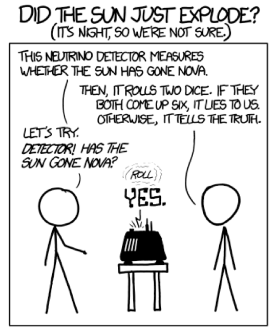
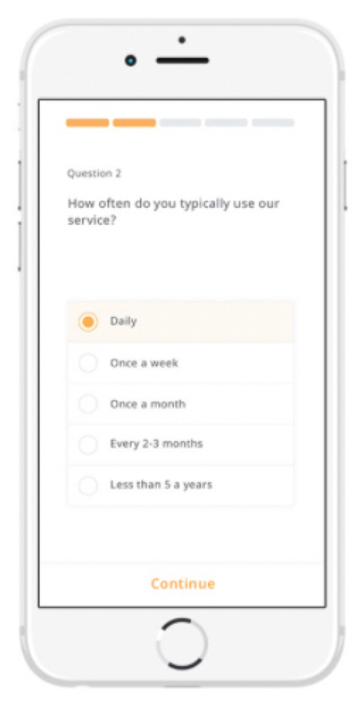
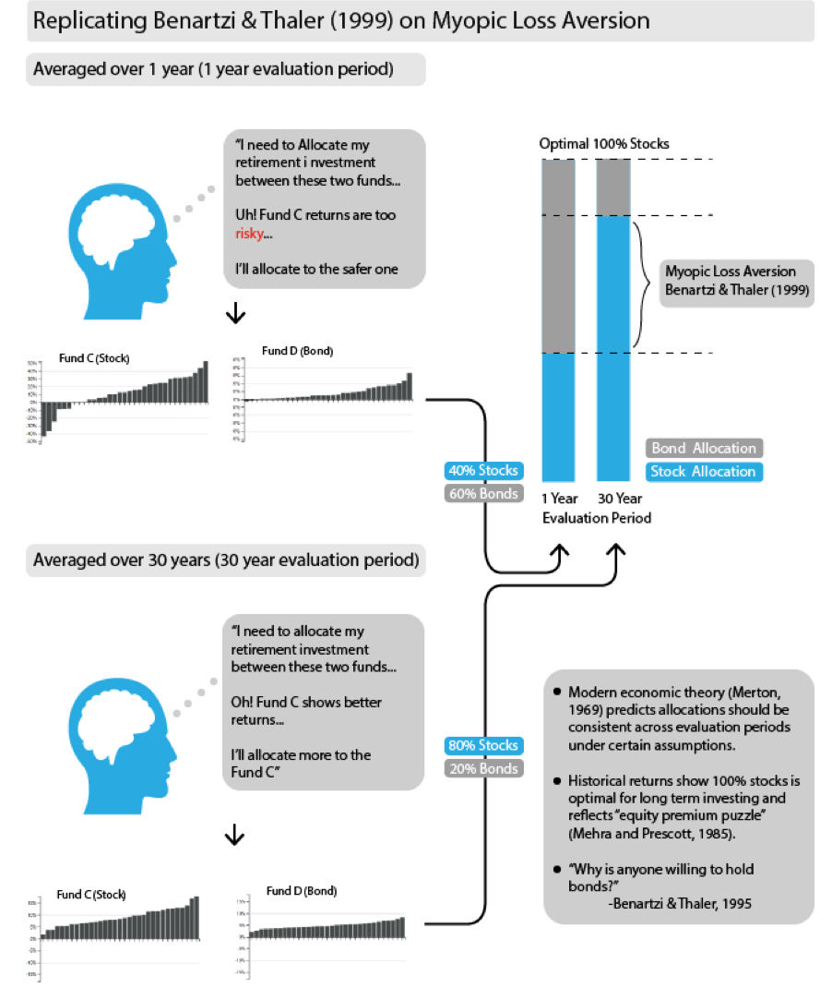
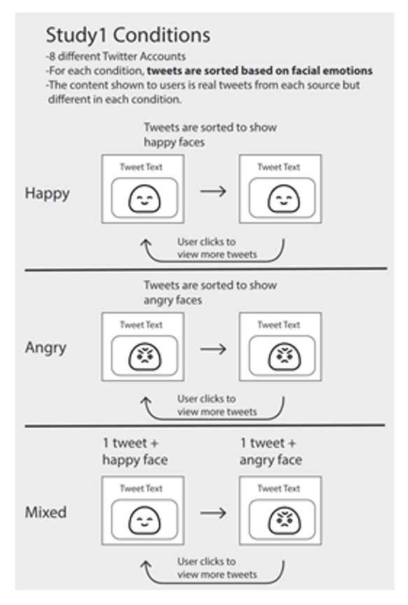
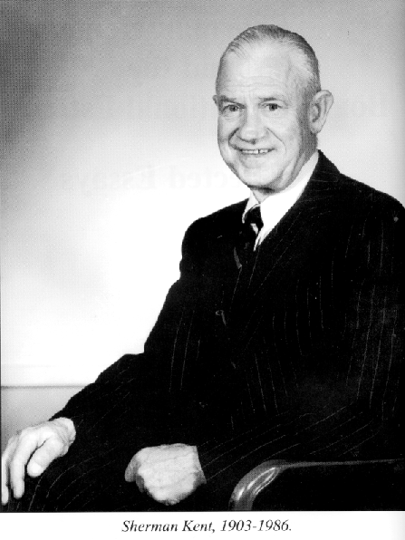

```{r meta, echo=FALSE, include=FALSE}
library(metathis)
meta() %>%
  meta_general(
    description = "Uncertainty visualizations for improving data science decision-making",
    generator = "xaringan and remark.js"
  ) %>% 
  meta_name("github-repo" = "wesslen/uncc-uncertainty") %>% 
  meta_social(
    title = "Uncertainty visualizations for improving data science decision-making",
    url = "uncc-frontiers-uncertainty.netlify.app",
    #image = "https://pkg.garrickadenbuie.com/drake-intro/assets/images/drake-intro-cover.jpg",
    #image_alt = "The first slide of the Reproducible Data Workflows with drake presentation, featuring the drake hex logo and neatly ordered row of items on a desk (eraser, pencil, coffee cup, paperclips).",
    og_type = "website",
    og_author = "Ryan Wesslen",
    twitter_card_type = "summary_large_image",
    twitter_creator = "@ryanwesslen"
  )
```


```{r xaringanExtra-freezeframe, echo=FALSE}
#xaringanExtra::use_freezeframe()
xaringanExtra::use_tachyons()
xaringanExtra::use_scribble()
```

```{r xaringan-themer, include = FALSE}
#devtools::install_github("gadenbuie/xaringanthemer")
#devtools::install_github("ropenscilabs/icon")
library(xaringanthemer); library(tidyverse); library(vembedr); library(xaringanExtra)
xaringan::summon_remark(to = "libs")
style_mono_accent(base_color = "#43418A")

#options(htmltools.preserve.raw = FALSE)
extra_css <- list(
  ".red"   = list(color = "red"),
  ".small" = list("font-size" = "70%"),
  ".large" = list("font-size" = "120%"),
  ".xlarge" = list(
    "font-size" = "250%",
    "vertical-align" = "middle" ),
  ".full-width" = list(
    display = "flex",
    width   = "100%",
    flex    = "1 1 auto"
  ),
  # ".remark-slide-content:after" = list(
  #   "content" = "'bit.ly/vis-uncertainty'",
  #   "position" = "absolute",
  #   "font-size" = "0.8em",
  #   "bottom" = "5px",
  #   "right" = "10px",
  #   "height" = "40px",
  #   "width" = "250px"
  # ),
  ".remark-slide-number" = list(
    "color" = "#FFFFFF",
    "opacity" = "1"
  )
)
# 
# div.my-footer {
#     background-color: #1a1917;
#     position: absolute;
#     bottom: 0px;
#     left: 0px;
#     height: 20px;
#     width: 100%;
# }
# 
# div.my-footer span {
#     font-size: 10pt;
#     color: #F7F8FA;
#     position: absolute;
#     left: 15px;
#     bottom: 2px;
# }

# <style type="text/css">
# .remark-slide-content {
#     font-size: 20px;
#     padding: 1em 4em 1em 4em;
# }
# </style>

#write_extra_css(css = extra_css, outfile = "custom.css")
```

```{r setup, include=FALSE}
options(htmltools.dir.version = FALSE)
knitr::opts_chunk$set(warning = FALSE, message = FALSE, 
  comment = NA, dpi = 300, echo = FALSE,
  fig.align = "center", out.width = "80%", cache = TRUE)
```

layout: true

<div class="my-footer"><span>bit.ly/vis-uncertainty</span></div>

---

# Introduction 

#### Day job: Bank of America

* Lead natural language processing (NLP) team

* Chief Data Scientist Organization, Enterprise Data Strategy & Governance

--

#### This presentation: UNC Charlotte Ribarsky Center and School of Data Science

* [20+ peer reviewed publications](https://scholar.google.com/citations?user=F40SbCkAAAAJ&hl=en) with 20+ UNCC research collaborators

* Human-computer interaction, visual analytics, information visualization, computational social science, cognitive science, psychology

* Taught Spring/Fall 2019 DSBA5122 Visual Analytics ([dsba5122.com](https://dsba5122.com))

* Collaborators: [Wenwen Dou](https://webpages.uncc.edu/~wdou1/), [Alireza Karduni](https://www.karduni.com/), [Doug Markant](http://www.markantlab.org/)

The views expressed herein are those of the presenter; they do not necessarily reflect the views of author's employer or any other group or individual.

???

[wesslen.netlify.app](wesslen.netlify.app)

---

class: center, middle

background-image: url("./img/uncertainty.png")
background-position: center
background-size: contain

???

From COVID-19 to gamestop stocks to suez canal

* these unexpected events foster uncertainty


---

class: center, middle, inverse

# Why is uncertainty often ignored in data analysis?

???

by uncertainty i mean not certain outcome.

---

# Data journalism


---

# Data analytics


---

# Artificial intelligence (e.g., NLP)


[Performance on Named Entity Recognition (NER) on CoNLL-2003 (English) over time: Sebastian Ruder](https://ruder.io/state-of-transfer-learning-in-nlp/)

---

# Why not visualize uncertainty?

#### Cognitively burdensome
#### User won't understand it
#### Implies inappropriate precision
#### Not integral to task
#### Undermines author's credibility
#### Hard to calculate
#### Lack of good visual techniques
#### Hard to evaluate (unclear goals)

[Jessica Hullman, Why Authors Don't Visualize Uncertainty (TVCG 2019)](https://ieeexplore.ieee.org/abstract/document/8805422)

---

class: center, middle, inverse

# Can better uncertainty representations enable better decision-making?

---


[Xiaoying Pu](https://www.notion.so/0c7c890ee6e44ac3886b28842c515df2?v=f5de2064ed60483da033f036de7ab52f)

Recent advances in communicating uncertainty in the fields **human-computer interaction** and **information visualizations** provide opportunities to better incorporate uncertainty into data science for better decision-making on the data.

---

class: center, middle


---

class: center, middle, inverse

# Probabilities are hard

---

class: center, middle


[Justin Gross (Washington Post)](https://www.washingtonpost.com/news/monkey-cage/wp/2016/11/29/how-to-better-communicate-election-forecasts-in-one-simple-chart/?noredirect=on&utm_term=.aa4aba18cf7b)

???

Uncertainty

* Knightian Uncertainty

* Entropy / information theory

* Frequentist: p-value, NHST

Decision-making: "choice between two or more competing courses of action" (Balleine, 2007 and Padilla et al., 2020)

argument: rise of visualization / hci best way to communicate uncertainty in data science (see padilla et al)

Choose dual-process framework: type 1 and type 2

People are very good at ignoring uncertainty... but it's especially true when we provide bad uncertainty representations" - Matthew Kay https://youtu.be/E1kSnWvqCw0

---

class: center, middle


[Justin Gross (Washington Post)](https://www.washingtonpost.com/news/monkey-cage/wp/2016/11/29/how-to-better-communicate-election-forecasts-in-one-simple-chart/?noredirect=on&utm_term=.aa4aba18cf7b)


---

# Frequency framing


[Claus Wilke](https://clauswilke.com/dataviz/visualizing-uncertainty.html)

---

class: center, middle


[What Do Vaccine Efficacy
Numbers Actually Mean?
By Carl Zimmer and Keith Collins
March 3, 2021](https://www.nytimes.com/interactive/2021/03/03/science/vaccine-efficacy-coronavirus.html)

---

class: center, middle, inverse

# Frequentist statistics are confusing


---

class: center, middle


[Claus Wilke](https://clauswilke.com/dataviz/visualizing-uncertainty.html)


???

Frequentist Confidence intervals (CIs) are best understood in the context of repeated sampling. For each sample, a specific confidence interval either includes or excludes the true parameter, here the mean. However, if we sample repeatedly, then the confidence intervals (shown here are 68% confidence intervals, corresponding to sample mean +/- standard error) include the true mean approximately 68% of the time.

A frequentist confidence interval: “How certain are we that the true parameter value is not zero?”

A Bayesian credible interval: “Where do we expect the true parameter value to lie?”

In practice, however, Bayesian and frequentist estimates are often quite similar. An advantage of the Bayesian approach is that it emphasizes thinking about the magnitude of an effect, whereas the frequentist thinking emphasizes a binary perspective of an effect either existing or not.


---

# Problem with null hypothesis testing


Pierre Dragicevic's [Fair Statistical Communication in HCI](https://hal.inria.fr/hal-01377894/document)

???

Problem not really with 

---

# Dichotomous thinking


---

# Hurricane forecasting


Liu et al.; Padilla, Hullman, and Kay (2020) 

---


class: center, middle, inverse

# Error bars are not enough


### Can animation help individuals better experience uncertainty?

---

class: center, middle


[Correll and Gleicher, TVCG 2014](https://graphics.cs.wisc.edu/Papers/2014/CG14/Preprint.pdf)

---

class: center, middle

#### How likely is it that B will be greater than A if many more draws are taken?
.pull-left[

]


--
.pull-right[


]

**Hypothetical outcome plots**

[UW Interactive Data Lab](https://medium.com/hci-design-at-uw/hypothetical-outcomes-plots-experiencing-the-uncertain-b9ea60d7c740) / [Hullman, Resnick and Adar, PLOS One 2015](https://journals.plos.org/plosone/article?id=10.1371/journal.pone.0142444)

<!-- Hullman, Resnick and Adar (2015); Padilla, Hullman, and Kay (2020)  -->

???


* uniform distribution?

* within bar bias? ()

* what if non-normal? [Correll & Gleicher, 2014](https://graphics.cs.wisc.edu/Papers/2014/CG14/Preprint.pdf)

* dichomotomous thinking

---

class: center, middle


[Kale, Kay, and Hullman, IEEE Vis 2020](https://arxiv.org/abs/2007.14516)

???

In an incentivized crowdsource study that won best paper in IEEE Vis -- the top academic conference for data visualization -- researchers studied strategies chart users rely on when making judgments and decisions from visualizations showing the effectiveness of an intervention (i.e., effect size). 

They expected chart users to rely on visual distance between distributions as a proxy for effect size, ignoring the spread of distributions. 

Users compared distributions of outcomes with and without intervention -- in this case whether to add a player to a hypothetical fantasy sports team.

They made two decisions:
1: How many times out of 100 do you estimate that your team would score more points with the new player than without the new player?
2: whether or not to pay for the new player 

They found that many users switch between strategies and seldom use the optimal strategy when one exists. Visualization designers should be mindful of possible strategies and how they may result in unintended readings of charts.

This is critically important for making A/B decisions or evaluating different models. But how could we even get such uncertainty measurements?

---

class: center, middle, inverse

# Bootstrapping

---

class: center, middle


[Claus Wilke](https://clauswilke.com/dataviz/visualizing-uncertainty.html)

---

class: center, middle


---

class: center, middle


---

class: center, middle


---

class: center, middle


<!-- --- -->

<!-- class: center, middle -->

<!--  -->

<!-- -- -->

<!--  -->

---

class: center, middle, inverse

# Bayesian analysis

```{r, out.width = "400px"}

```

@john_t_ormerod

---

class: center, middle



---

class: center, middle


---

class: center, middle


[The Economist](https://projects.economist.com/us-2020-forecast/president/how-this-works)

???

Bayesian analysis assesses the uncertainty of the hypothesis in light of the observed data, and a frequentist analysis assesses the uncertainty of the observed data in light of an assumed hypothesis.

https://www.bayesrulesbook.com/chapter-1.html#thinking-like-a-bayesian

---

class: center, middle

# A / B Evaluation in UI/UX

Which design reduces survey "drop-off"? [Villar, Callegaro, and Yang (2013)](https://journals.sagepub.com/doi/10.1177/0894439313497468)

.pull-left[
No progress bar (control)
```{r, out.width = "200px"}
knitr::include_graphics("./img/ui1.png")
```
]
.pull-right[
"Fast-to-slow" progress bar
```{r, out.width = "200px"}

```
]


---

class: center, middle


[Kay, Nelson, and Hekler, ACM CHI 2016](https://mucollective.northwestern.edu/files/2016-BayesIncentivesHCI-CHI.pdf)

---

class: middle, center, inverse


Dr. William (Bill) Ribarsky, former Bank of America Endowed Professor

Research at UNCC Ribarsky Center for Visual Analytics (viscenter.uncc.edu)

---

# Correlation judgement


```{r, out.width = "800px"}
knitr::include_graphics("./img/line-cone1.png")
```

[Karduni, Markant, Wesslen, and Dou (InfoVis 2020)](https://arxiv.org/abs/2008.00058)

---

# Prior beliefs

```{r, out.width = "800px"}

```

[Karduni, Markant, Wesslen, and Dou (InfoVis 2020)](https://arxiv.org/abs/2008.00058)

---

# Bayesian cognitive modeling

```{r, out.width = "900px"}
knitr::include_graphics("./img/line-cone.gif")
```

[Karduni, Markant, Wesslen, and Dou (InfoVis 2020)](https://arxiv.org/abs/2008.00058)

???

Bayesian cognitive modeling provide a normative benchmark for how beliefs should change depending on the strength of the evidence and participants’ uncertainty. 

For instance, a person who is confident that variables are negatively correlated may only shift their beliefs a small amount after seeing a dataset with a positive sample correlation. 

A second person who is highly uncertain about the relationship, however, may be more strongly influenced by the same data and report posterior beliefs that are closely matched to the sample correlation. 

This framework also allows us to identify when people systematically fail to adjust their beliefs as predicted by the Bayesian model.

Three MTurk experiments where we tested line-cone interactive technique built in D3 (javascript)

---

class: center, middle

# Investing for Retirement


Wesslen, Karduni, Markant, and Dou (In Review)

---

class: center, middle

# Investing for Retirement



Wesslen, Karduni, Markant, and Dou (In Review)


---


Wesslen, Karduni, Markant, and Dou (In Review)


---

# MTurk Experiment


Wesslen, Karduni, Markant, and Dou (In Review)

???

Bayesian 66% and 95% credible intervals for means by visualization condition

---

class: center, middle, inverse

# Final thoughts

---

class: center, middle


[Ben Schneiderman: Human-Centered Artificial Intelligence](https://hcil.umd.edu/human-centered-ai/)

---

class: center, middle


[Ben Schneiderman: Human-Centered Artificial Intelligence](https://hcil.umd.edu/human-centered-ai/)

---

# Key takeaways

### Be thoughtful about uncertainty 

### Think beyond your college (Frequentist) stats class

### Better understanding of uncertainty, better human-AI collaboration?

---

# Thank you and questions!

* Collaborators: [Wenwen Dou](https://webpages.uncc.edu/~wdou1/), [Alireza Karduni](https://www.karduni.com/), [Doug Markant](http://www.markantlab.org/)

* Vis Researchers: [Matthew Kay](http://www.mjskay.com/), [Jessica Hullman](http://users.eecs.northwestern.edu/~jhullman/), [Lace Padilla](http://space.ucmerced.edu/home), [Alex Kale](http://students.washington.edu/kalea/), [Claus Wilke](https://clauswilke.com/) among others!

.pull-left[
#### Packages / tools

|       | R | Python |
| ----------- | ----------- | ----------- |
| Bootstrapping      | [`rsample`](https://rsample.tidymodels.org/)       | [`bootstrapped`](https://pypi.org/project/bootstrapped/)<br/> [`DABEST`](https://acclab.github.io/DABEST-python-docs/index.html) |
| Bayesian Statistics | [`rstan`](https://mc-stan.org/users/interfaces/rstan)<br />[`brms`](https://paul-buerkner.github.io/brms/)<br />[`tidybayes`](http://mjskay.github.io/tidybayes/)    | [`PyMC3`](https://docs.pymc.io/) |
| Uncertainty Visualizations | [`ggdist`](https://docs.pymc.io/D) | [`uncertainty-toolbox`](https://github.com/uncertainty-toolbox/uncertainty-toolbox) |

]

.pull-right[
#### Helpful references

* Padilla, Kay, and Hullman (2020): [Uncertainty Visualization](https://psyarxiv.com/ebd6r/)

* Hullman et al. (2019): [In Pursuit of Error: A Survey of Uncertainty Visualization Evaluation](https://idl.cs.washington.edu/files/2019-UncertaintyEval-InfoVis.pdf)

* Bhatt et al. (2021): [Uncertainty as a Form of Transparency: Measuring, Communicating, and Using Uncertainty](https://arxiv.org/abs/2011.07586)
]

---

class: middle, center, inverse

# Appendix


---

# Uncertainty in identifying misinformation



Karduni, Wesslen, Markant, and Dou (In Review; ACM CSCW 2021)

---


class: center, middle



"Father of Intelligence Analysis"

---
class: center, middle


[Barclay et al., 1977](https://files.eric.ed.gov/fulltext/ED153329.pdf)

---

class: center, middle


Pherson

---
class: center, middle


