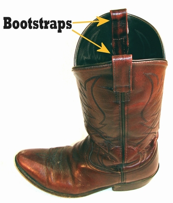
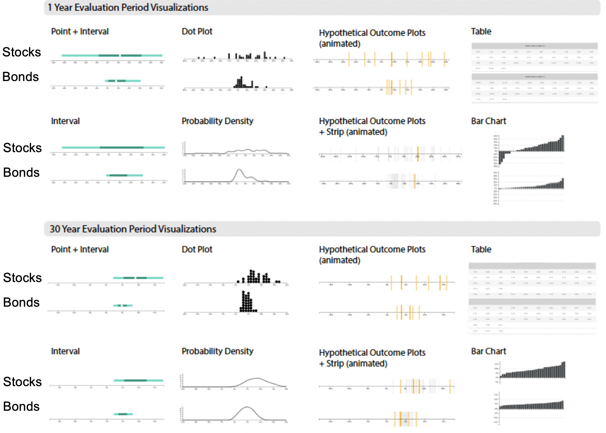

```{r meta, echo=FALSE, include=FALSE}
library(metathis)
meta() %>%
  meta_general(
    description = "Uncertainty visualizations for improving data science decision-making",
    generator = "xaringan and remark.js"
  ) %>% 
  meta_name("github-repo" = "wesslen/2021-analytics-frontiers-uncertainty") %>% 
  meta_social(
    title = "Uncertainty visualizations for improving data science decision-making: How I learned to stop worrying and love uncertainty (by visualizing it)",
    url = "uncc-frontiers-uncertainty.netlify.app",
    #image = "https://pkg.garrickadenbuie.com/drake-intro/assets/images/drake-intro-cover.jpg",
    #image_alt = "The first slide of the Reproducible Data Workflows with drake presentation, featuring the drake hex logo and neatly ordered row of items on a desk (eraser, pencil, coffee cup, paperclips).",
    og_type = "website",
    og_author = "Ryan Wesslen",
    twitter_card_type = "summary_large_image",
    twitter_creator = "@ryanwesslen"
  )
```


```{r xaringanExtra-freezeframe, echo=FALSE}
#xaringanExtra::use_freezeframe()
xaringanExtra::use_tachyons()
xaringanExtra::use_scribble()
```

```{r xaringan-themer, include = FALSE}
#devtools::install_github("gadenbuie/xaringanthemer")
#devtools::install_github("ropenscilabs/icon")
library(xaringanthemer); library(tidyverse); library(vembedr); library(xaringanExtra)
xaringan::summon_remark(to = "libs")
style_mono_accent(base_color = "#43418A")

#options(htmltools.preserve.raw = FALSE)
extra_css <- list(
  ".red"   = list(color = "red"),
  ".small" = list("font-size" = "70%"),
  ".large" = list("font-size" = "120%"),
  ".xlarge" = list(
    "font-size" = "250%",
    "vertical-align" = "middle" ),
  ".full-width" = list(
    display = "flex",
    width   = "100%",
    flex    = "1 1 auto"
  ),
  # ".remark-slide-content:after" = list(
  #   "content" = "'bit.ly/vis-uncertainty'",
  #   "position" = "absolute",
  #   "font-size" = "0.8em",
  #   "bottom" = "5px",
  #   "right" = "10px",
  #   "height" = "40px",
  #   "width" = "250px"
  # ),
  ".remark-slide-number" = list(
    "color" = "#FFFFFF",
    "opacity" = "1"
  )
)
# 
# div.my-footer {
#     background-color: #1a1917;
#     position: absolute;
#     bottom: 0px;
#     left: 0px;
#     height: 20px;
#     width: 100%;
# }
# 
# div.my-footer span {
#     font-size: 10pt;
#     color: #F7F8FA;
#     position: absolute;
#     left: 15px;
#     bottom: 2px;
# }

# <style type="text/css">
# .remark-slide-content {
#     font-size: 20px;
#     padding: 1em 4em 1em 4em;
# }
# </style>

#write_extra_css(css = extra_css, outfile = "custom.css")
```

```{r setup, include=FALSE}
options(htmltools.dir.version = FALSE)
knitr::opts_chunk$set(warning = FALSE, message = FALSE, 
  comment = NA, dpi = 300, echo = FALSE,
  fig.align = "center", out.width = "80%", cache = TRUE)
```

layout: true

<div class="my-footer"><span>bit.ly/vis-uncertainty</span></div>

---

# Introduction 

#### Day job: Bank of America

* Lead natural language processing (NLP) team

* Chief Data Scientist Organization, Enterprise Data Strategy & Governance

--

#### This presentation: UNC Charlotte Ribarsky Center and School of Data Science

* [20+ peer reviewed publications](https://scholar.google.com/citations?user=F40SbCkAAAAJ&hl=en) with 20+ UNCC research collaborators

* Human-computer interaction, visual analytics, information visualization, computational social science, cognitive science, psychology

* Taught Spring/Fall 2019 DSBA5122 Visual Analytics ([dsba5122.com](https://dsba5122.com))

* Collaborators: [Wenwen Dou](https://webpages.uncc.edu/~wdou1/), [Alireza Karduni](https://www.karduni.com/), [Doug Markant](http://www.markantlab.org/)

---

class: center, middle

background-image: url("./img/uncertainty.png")
background-position: center
background-size: contain

???

From COVID-19 to gamestop stocks to suez canal

* these unexpected events foster uncertainty


---

class: center, middle, inverse

# Why is uncertainty often ignored in data analysis?

???

uncertainty refers to our lack of knowledge about something.

the term uncertainty can have many meanings:
* risk vs. uncertainty from frank knight in economics
* entropy from shannon's information theory
* alea-toric (inherent noise/randomness) vs ep-is-tem-ic (lack sufficient data)

to avoid a long philosophical debate, in this talk i want to focus on more traditional measurements what is a probability and understanding what are confidence intervals or bayesian statistics

but let's focus some example first

---

# Data journalism


???

simple headlines and bullet points that may obfuscate what we don't know about the data


---

# Data analytics


???

or in industry where we need data analytics dashboards to summarize information like simple averages or even forecast sales.

where we think uncertainty may "be too busy" or "confusing" for executives and prefer to sweep under the rug what we don't know

---

# Artificial intelligence (e.g., NLP)


[Performance on Named Entity Recognition (NER) on CoNLL-2003 (English) over time: Sebastian Ruder](https://ruder.io/state-of-transfer-learning-in-nlp/)

???

or even in AI like NLP


---

# Why not visualize uncertainty?

#### Cognitively burdensome
#### User won't understand it
#### Implies inappropriate precision
#### Not integral to task
#### Undermines author's credibility
#### Hard to calculate
#### Lack of good visual techniques
#### Hard to evaluate (unclear goals)
#### Unclear if error in data vs uncertainty

[Jessica Hullman, Why Authors Don't Visualize Uncertainty (TVCG 2019)](https://ieeexplore.ieee.org/abstract/document/8805422)

???

1. too busy or cognitively burdening - maybe non-expert?

2. precision vs simplicity

3. hard to calculate: what the heck is a confidence interval anyways?

4. uncertainty visualizations of old are antiquated and things like error bars may be misinterpreted and need better uncertainty representations

5. how do we know if the uncertainty visualization is effective? 

6. ryan -- in industry many companies struggle at data quality and remain fixated on deterministic to ensure "numbers align" and are "correct"

---

class: center, middle, inverse

# Can better uncertainty representations enable better decision-making?

"People are very good at ignoring uncertainty... but it's especially true when we provide bad uncertainty representations" - Matthew Kay

???


Decision-making: "choice between two or more competing courses of action" (Balleine, 2007 and Padilla et al., 2020)

argument: rise of visualization / hci best way to communicate uncertainty in data science (see padilla et al)


---


[Xiaoying Pu, Matthew Kay](https://www.notion.so/0c7c890ee6e44ac3886b28842c515df2?v=f5de2064ed60483da033f036de7ab52f)

Advances in communicating uncertainty in the fields **information visualization**, **visual analytics**, and **human-computer interaction** provide opportunities to better incorporate uncertainty into data science for better decisions.

---

class: center, middle


???

we have a three step process.

first, we use theories from psychology, cognitive science and behavioral economics to motivate research areas for data visualization

second, using computer science tools like web development, machine learning, or back end engineering like database or deploying apps we develop experiment systems for either in-lab or crowdsource experiments like MTurk. this step can sometimes take the bulk of time as it requires larger teams that have a variety of skill set to develop these stand alone, custom ui typically leveraging languages like javascript, html/css, and python.

third, we implement designs for randomized controlled experiments in which participants are randomly assigned to different treatments like a visualization design or interactive feature. 

this enables easier reading of the treatment effects by controlling for confounding variables along with causal inference statistics like mixed effects modeling where we may control for individual level variation across participants or trials. in addition, qualitative feedback like open-ended responses can be critical in understanding the strategies users employed to come to their decisions.

with such experimental results, new theories can be developed or modified old theories, and the cycle continues.

but to transition, i'd like to now focus on five core concepts related to uncertainty from vis research.

---

class: center, middle, inverse

<blockquote class="twitter-tweet tw-align-center" data-width="350"><p lang="en" dir="ltr">Understanding uncertainty and probability is hard 🤣 <a href="https://t.co/ebIEdI8DI3">https://t.co/ebIEdI8DI3</a></p>&mdash; Ryan Wesslen (@ryanwesslen) <a href="https://twitter.com/ryanwesslen/status/1368247469411287043?ref_src=twsrc%5Etfw">March 6, 2021</a></blockquote> <script async src="https://platform.twitter.com/widgets.js" charset="utf-8"></script>

???

first, is the simple notion from psychology that probabilities are hard.

to indicate this, ive highlighted a hilarious tweet (via tik-tok) that provides an example of why probabilities are hard for individuals to calculate.

i won't play the video as i'd expect the audio may not work, but i am 141% confident the interested viewer may enjoy it 

---

class: center, middle


[Justin Gross (Washington Post)](https://www.washingtonpost.com/news/monkey-cage/wp/2016/11/29/how-to-better-communicate-election-forecasts-in-one-simple-chart/?noredirect=on&utm_term=.aa4aba18cf7b)

???

so to describe the challenge of probabilities, let's take an example from the washington post describing the potential predictions of the 2016 presidential election.

before the election, different pollsters had different predictions for Donald Trump's chance.

but looking at these probabilities, many individuals may perceive differences, namely for low probabilities, it's easier to associate them as nearly or even zero probability, especially for something like Huffington Posts's low 2%. 

---

class: center, middle


[Justin Gross (Washington Post)](https://www.washingtonpost.com/news/monkey-cage/wp/2016/11/29/how-to-better-communicate-election-forecasts-in-one-simple-chart/?noredirect=on&utm_term=.aa4aba18cf7b)

???

instead risk theater plots -- risk characterization theatre

idea is to translate probabilities to the situtation in which if i were to give you a random ticket, what would be likelihood of seat under the same probability.

we can immediately see that 2% while very low, is not equal to zero and still better frame some chance of the event occurring.

can be helpful in other areas with low probabilities like health care -- for example very rare side effects to vaccines.

this core idea is based on the idea of "frequency framing" of visualization, popularized by the psychologist Gert Gigerinzer

---

# Frequency framing


[Claus Wilke](https://clauswilke.com/dataviz/visualizing-uncertainty.html)

---

class: center, middle


[What Do Vaccine Efficacy
Numbers Actually Mean?](https://www.nytimes.com/interactive/2021/03/03/science/vaccine-efficacy-coronavirus.html) 
By Carl Zimmer and Keith Collins, March 3, 2021

---

class: center, middle, inverse

# Statistics can be confusing


---

class: center, middle


???

The large represents the estimated efficacy per with 95% confidence intervals showing lower and upper bounds

Such interval sare convenient because they allow us to show many estimates with their uncertainties all at once. 

however, a major misconception with confidence intervals is that we can interpret these intervals as where we'd expect to find the true efficacy value.

---

<blockquote class="twitter-tweet tw-align-center"><p lang="en" dir="ltr">Proper confidence interval definition in the NYTimes, love to see it!<br><br>“If scientists came up with confidence intervals for 100 different samples using this method, the efficacy would fall inside the confidence intervals in 95 of them.”<a href="https://t.co/IwMSHZaGMj">https://t.co/IwMSHZaGMj</a></p>&mdash; Lucy D’Agostino McGowan (@LucyStats) <a href="https://twitter.com/LucyStats/status/1367629174672928770?ref_src=twsrc%5Etfw">March 5, 2021</a></blockquote> <script async src="https://platform.twitter.com/widgets.js" charset="utf-8"></script>

???

Or highlighted by Lucy McGowan of Wake Forest university -- great host of the podcast casual inference highly recommend -- quotes the true definition of a classical confidence interval:

---

class: center, middle


[Claus Wilke](https://clauswilke.com/dataviz/visualizing-uncertainty.html)


???

Such Confidence intervals (CIs) -- sometimes referred to as Frequentist confidence intervals -- are best understood in the context of repeated sampling. For each sample, a specific confidence interval either includes or excludes the true parameter, here the mean. However, if we sample repeatedly, then the confidence intervals (shown here are 68% confidence intervals, corresponding to sample mean +/- standard error) include the true mean approximately 68% of the time.

A frequentist confidence interval: “How certain are we that the true parameter value is not zero?”

A Bayesian credible interval: “Where do we expect the true parameter value to lie?”

In practice, however, Bayesian and frequentist estimates are often quite similar. An advantage of the Bayesian approach is that it emphasizes thinking about the magnitude of an effect, whereas the frequentist thinking emphasizes a binary perspective of an effect either existing or not.


---

# Issue with null hypothesis testing


Pierre Dragicevic's [Fair Statistical Communication in HCI](https://hal.inria.fr/hal-01377894/document)

[Szucs and Ioannidis, 2017: "When Null Hypothesis Significance Testing (NHST) Is Unsuitable for Research: A Reassessment"](https://www.frontiersin.org/articles/10.3389/fnhum.2017.00390/full)

???

Problem with null hypothesis statistical testing or NHST

* let's take an example of a doctor deciding on one of four pills for weight loss

* the right hand side provides the estimated mean weight loss for each pill along with the 95% confidence intervals and p-values

* according to NHST, we're taught to look for a p-value less than 0.05 to indicate statistical significant differences between zero with 95% confidence.

* in this case, we find pills 1, 3 and 4 and may even conclude pill 1 is the best since it has the lowest p -value and thus most evidence that the pill provides non-zero weight loss

* but i want to focus on two problems. 1 - this ignores effect size (answers which pill will reduce most weight loss) in which we'd likely want pill 4. if we used the lowest p value, we may choose pill 1 that is likely the worst option

* 2nd - we can notice the arbitrary nature of p-values in pill 2 and 3 that have nearly identical effect sizes and uncertainty but in the "black and white" world of null hypothesis testing we'd confidently reject the null in pill 3 (p value less than 0.05) but not have sufficient evidence for pill 2 and may even (wrongly) conclude pill 2 is ineffective. 

these points emphasize challenges identified of research associated with replication crisis in psychology and where some academics have called for reassessing the suitability of null hypothesis testing.

---

class: center, middle

# Dichotomous thinking


???

this highlights the susceptibility of p-values to overemphasize the world as a dichotomous or binary outcome in which things are too black and white when in fact our data has many colors. this is sometimes called "Cognitive Categories"

this is the data visualization theory that when visual boundaries, such as isocontours and error bars, are used for continuous data, the boundaries lead people to conceptualize the data as categorical. This theory is based on work by the psychologist Barbra Tversky, in which she proposed that visual-spatial communications are intrinsically related to thought

The Cone of Uncertainty is the current method used by the National Hurricane Center, and the border of the cone represents a 66% confidence interval around the mean predicted path. In numerous studies, researchers have found that viewers believe areas inside the cone are categorically different from areas outside the cone. 

When visualized with boundaries, viewers cannot ascertain that there is a distribution of uncertainty in the storm’s path. The cognitive category created by the border of the cone makes viewers believe that areas inside the cone are in the danger zone, and areas outside are relatively safe. 

Participants’ decisions are influenced by a subconscious categorical interpretation of the cone even when they are given instructions about how to interpret the visualization correctly and they can report the correct judgments at the end of the study. The result of this inaccurate and persistent categorization may cause some people who reside just outside the cone to believe they are safe and not take preparatory actions.

---

class: center, middle

# Ensemble hurricane paths


Liu et al. (2016); [Padilla, Hullman, and Kay (2020)](https://psyarxiv.com/ebd6r/download) 

???

Alternatively ensemble hurricane paths that provide individual forecasted paths have received some criticism because older versions can look confusing, like a plate of spaghetti on the right. 

Researchers have addressed concerns by developing a method for reconstructing the predicted paths from runs of the model like on the left. The paths of the reconstructed ensembles have good separation and still communicate the uncertainty in the trajectory of the storm. The other benefit of using a path reconstruction procedure is that fewer lines are needed to show the full range of outcomes, which declutters the display. In the case of hurricane forecasting, decluttering the display allows researchers to make the paths thicker and represent the intensity of the storm in color and the size of the storm with a glyph. In one study, researchers found that their study participants could effectively make decisions that incorporated the path, size, and intensity of the storm when it was visualized as an ensemble display

---


class: center, middle, inverse

# Error bars are not enough


xkcd

???

the next idea i want to cover is that error bars are not enough for all situations of visualizing uncertainty.

---

class: center, middle


[Correll and Gleicher, TVCG 2014](https://graphics.cs.wisc.edu/Papers/2014/CG14/Preprint.pdf)

???

research in information visualization has explored cases in which error bars may be misinterpreted like the notion that the values within the bars are uniform or the notion of within bar bias in which participants misread classic bar plus error like on the left, mistaking for values below the bar but within the error as coming from a different population above the bar but in the same error range.

instead, researchers have explored alternate encodings like the gradient plot or violin plots and in user experiments identified situations that lead to better decisions.


---

class: center, middle

## Chocolate ratings by country

.pull-left[
```{r, out.width = "500px"}

```
]
.pull-right[

```{r, out.width = "500px"}

```
]

Source: Claus Wilke's [`ungeviz` package](https://wilkelab.org/ungeviz/articles/sampling-bootstrapping.html)


???

for example, using an example of chocolate ratings by country, we may be worried that classic error bars may lead to dichotomous thinking and thus overlay a gradient plot (shown on right) to concede some uncertainty around the distribution's tails and outside our error bars.

---

class: center, middle

#### How likely is it that B will be greater than A if many more draws are taken?
.pull-left[

]

???

alternatively, other researchers have found situations in which animations may enable better experience of uncertainty. 

for example, in another study participants were given the following scenario and charts. they were told that scientists have measured the concentration of two chemical solutes (A and B, each measured in parts per million) in many vials of sea water. Horizontal blue lines are the means, dashed vertical bars capture 95% of the measurements for each solute, and to assume independence.

they were then asked: "how likely is it that B will be greater than A if many more draws are taken?"

--
.pull-right[


]

**Hypothetical outcome plots**

[UW Interactive Data Lab](https://medium.com/hci-design-at-uw/hypothetical-outcomes-plots-experiencing-the-uncertain-b9ea60d7c740) / [Hullman, Resnick and Adar, PLOS One 2015](https://journals.plos.org/plosone/article?id=10.1371/journal.pone.0142444)

<!-- Hullman, Resnick and Adar (2015); Padilla, Hullman, and Kay (2020)  -->

???

as an alternative, researchers developed the hypothetical outcome plot or HOP
HOP. this plot has two steps. (1) Draw a sample of hypothetical outcomes (draws) from the distribution; (2) for each, make a plot that becomes one frame in an animated presentation. 

For example, the right depicts several frames for a HOPs visualization for a single random variable. Each frame contains a horizontal bar that depicts a specific outcome, one draw for that random variable.

they researchers found that HOPs lead to more accurate estimates of
properties even of very simple multivariate distributions consisting of just two and three variables, both when the variables are independent or correlated. several follow up studies have looked at HOPs in situations like identifying trends and effect size judgements, which may be critically important for making A/B decisions or evaluating different models. 

But outside of classical null hypothesis testing, are there other ways to measure?


---

class: center, middle, inverse

# Bootstrapping



Bradley Efron's 1979 "Bootstrap Methods: Another Look at the Jackknife" 

---

class: center, middle


[Claus Wilke](https://clauswilke.com/dataviz/visualizing-uncertainty.html)

---

class: center, middle


Source: [Seeing Theory Website by Kunin, Guo, Devlin and Xiang](https://seeing-theory.brown.edu/frequentist-inference/index.html#section3)

---

class: center, middle


Source: [Seeing Theory Website by Kunin, Guo, Devlin and Xiang](https://seeing-theory.brown.edu/frequentist-inference/index.html#section3)

---

class: center, middle


Source: [Seeing Theory Website by Kunin, Guo, Devlin and Xiang](https://seeing-theory.brown.edu/frequentist-inference/index.html#section3)

---

class: center, middle


Source: Claus Wilke's [`ungeviz` package](https://wilkelab.org/ungeviz/articles/sampling-bootstrapping.html)

???

we can expand this idea to statistical models -- like a simple regression model in which we can visualize the resampling and the different weights and regression fit for that "draw" using hypothetical outcome plots. in this way, we could use other visualization techniques to measure the uncertainty or even plot distributions for model fit statistics like R^2 or accuracy measures like precision, recall or F1 in classification problems.

now while bootstrapping is a great, simple and intuitive techinque -- one of it's biggest weakness is it can only consider observed past events and indirectly assumes that only the events in the history can repeat. but instead, sometimes there are events we haven't seen before.

alternatively, what about if we have knowledge or prior beliefs that we want to consider along with our data?

---

class: center, middle, inverse

# Bayesian analysis

```{r, out.width = "400px"}
knitr::include_graphics("./img/starwars.jpeg")
```

@john_t_ormerod

???

and this is where we'll move to the dark side of Bayesian analysis.

built from Thomas Bayes' derived bayes rule, bayesian analysis is the counterpart to more classically "frequentist" or null hypothesis testing paradigms. 

Frequentists are so named for their interpretation of probability as the long-run relative frequency of a repeatable event.

Bayesians, a probability measures the relative plausibility of an event.

it's reframing of proabilities to be degrees of beliefs


so in normal data science fashion, to describe the differences between frequentists and bayesian perspectives let's consider xkcd cartoon.

---

class: center, middle


xkcd

???

did the sun explode?

---

class: center, middle


xkcd

???

how do we even measure probabilities for one time events within frequentist perspective?

Bayesian analysis assesses the uncertainty of the hypothesis in light of the observed data

frequentist analysis assesses the uncertainty of the observed data in light of an assumed hypothesis.

---

class: center, middle


[The Economist](https://projects.economist.com/us-2020-forecast/president/how-this-works)

???

one common place is election predictions. these are helpful as we update our beliefs about the elections as new data -- polls -- are updated.

to describe the bayesian framework, we'll use a figure from the economist and outlien the 3 step process in bayesian inference.

first, we assume some prior distribution or prediction. this reflects what we belief or know about the world before looking at data.

next we observe new data and can accordingly calculate the likelihood of that data.

third, using both our prior and likelihood to calculate the posterior prediction. this last step is the ultimate combination of both our prior beliefs and the new data.

from this perspective, it's important to consider three important points.

first in bayesian analysis, we focus on distributions, especially the posterior, rather than on point estimates and uncertainty around that estimate -- as in frequentist. this is one reason we can better visualize the full posterior as opposed to frequentist uncertainty that lends itself to smoother distributions and hence simple error bars rather than detailed density plots.

second, the more data we observe, the less role our priors will have. sometimes a criticism of bayesian analysis is questions on how priors are derived; which many bayesian analyses start with a uniform or uninformative prior that once we update moderate data, our posterior prediction tends to provide consistent results with frequentist estimates.

last, the combination of priors with data can act as a conservative estimator, especially for low sample observations like the sun exploding -- the reason is that we can weight our prior with knowledge that can "regularize" or reweigh our data with beliefs about the population. related ideas like pooling can ensure the sub-groups values conservatively tend towards the entire population values as well too.

so for the last section, i'd like to provide two experiments using bayesian analysis.

---

class: middle, center, inverse


Dr. William (Bill) Ribarsky, former UNCC Bank of America Endowed Chair

Research at UNCC Ribarsky Center for Visual Analytics (viscenter.uncc.edu)

???

I'd like to finish with recent research at UNCC Ribarsky Center for Visual Analytics, which was recently renamed after Dr. Bill Ribarsky, the former UNCC BofA Endowed Chair and Professor who sadly passed in 2017.

Bill had an amazing transformative career where he helped revolutionize visualization research, first in Georgia Tech where he researched VR and interactive visualizations in the 80s - 90s and then transformed UNCC into a powerhouse of the burdening fields of visualization when he joined in 2004.

His enduring partnerships with practice including companies like Bank of America as well as government agencies like the Department of Homeland Security, DOE, U.S. Department of Transportation, EPA showed how relevant vis research is to practioners and we're proud to continue the legacy Bill paved.

---

# Correlation judgement

```{r, out.width = "800px"}

```

[Karduni, Markant, Wesslen, and Dou (IEEE InfoVis 2020)](https://arxiv.org/abs/2008.00058)

???

In one article published in last year's IEEE InfoVis conference -- the premier academic conference for data vis research -- our research group studied the problem of uncertainty visualizations and their effects in basic correlation judgments.

Data speaks for itself? Really? What about prior beliefs that may influence or effect perception of data?

---

# Prior beliefs

```{r, out.width = "800px"}
knitr::include_graphics("./img/line-cone2.png")
```

[Karduni, Markant, Wesslen, and Dou (IEEE InfoVis 2020)](https://arxiv.org/abs/2008.00058)

???

Instead of data being objective, prior beliefs may constrain perception where individuals who believe contrary to the data may become 

This work is important is because it's a big step towards our ultimate goal: identifying, measuring and hopefully mitigating confirmation bias, which is the tendency to seek only information that confirms ones prior beliefs.

In other applications we've examined this to identifying misinformation on twitter and foresee many other applications.

---

class: center, middle

# Line + Cone Prior Elicitation

What is the relationship between income tax rate and poverty rate of cities?

```{r, out.width = "400px"}

```

Built with D3.js (javascript)

---

class: center, middle

# Bayesian cognitive modeling

```{r, out.width = "900px"}
knitr::include_graphics("./img/line-cone.gif")
```

[Karduni, Markant, Wesslen, and Dou (IEEE InfoVis 2020)](https://arxiv.org/abs/2008.00058)

???

To address 

Bayesian cognitive modeling provide a normative benchmark for how beliefs should change depending on the strength of the evidence and participants’ uncertainty. 

For instance, a person who is confident that variables are negatively correlated may only shift their beliefs a small amount after seeing a dataset with a positive sample correlation. 

A second person who is highly uncertain about the relationship, however, may be more strongly influenced by the same data and report posterior beliefs that are closely matched to the sample correlation. 

This framework also allows us to identify when people systematically fail to adjust their beliefs as predicted by the Bayesian model.

Three MTurk experiments where we tested line-cone interactive technique built in D3 (javascript)


---

class: center, middle

# Investing for Retirement


Wesslen, Karduni, Markant, and Dou (In Review)

???

In our most recent experiment, we leveraged an important idea from Behavorial Economist -- notably 2017 nobel prize winner richard thaler and his then student shlomo benartzi -- on the idea of myopic loss aversion, which is the idea that more we evaluate our portfolios, the higher our chance of seeing a loss and, thus, the more susceptible we are to loss aversion.

in a 1999 experiment, benartzi and thaler found that the way we frame investment returns for long term investing -- like retirement over 30 years -- can have a huge effect on basic allocation decision on stocks versus bonds. their experiment was a powerful explanation for the deep puzzle of the equity premium puzzle in economics, in which economists' mathematical models could not explain the excessively high historical outperformance of stocks over much safer bonds. 

for their simple "pencil-and-paper" experiment, benartzi and thaler asked retirement participants to decide on how to allocate their retirement (invest over 30 years) but randomly choose half of participants to view short term returns, which due to ideas like prospect theory participants were scared by the short term negative losses more than the larger upside of bonds. 

investors seemed to be scared by the negative returns and inable to do the mental accounting that the 1 year returns to 30 years, participants under allocated to stocks and thus likely made in efficient decisions for retirement.

in theory if investing over 30 years, optimal decision is to allocate more to stocks -- key to note true for retirement accounts where need is long term and this may not translate for average investors who's planning horizon is much shorter or may have uncertainty due to unexpected liquidity needs.

---

class: middle, center



Wesslen, Karduni, Markant, and Dou (In Review)

???

what we want to know is could we replicate their findings in an incentivized mturk study and could more recent uncertainty visualizations like HOPs or dot plots nudge participants to allocate more to stocks.

---

class: middle, center

#### MTurk stock allocation decisions by visualization and evaluation period. Bayesian regression posterior means and 66% / 95% credible intervals

```{r, out.width = "500px"}
knitr::include_graphics("./img/myopic-loss-aversion4.png")
```

Wesslen, Karduni, Markant, and Dou (In Review)

#### R packages used [`ggdist`](https://mjskay.github.io/ggdist/), [`tidybayes`](http://mjskay.github.io/tidybayes/), and [`brms`](https://paul-buerkner.github.io/brms/) packages

???

each dot in the plot represents the mean stock allocation users decided by visualization (each row) or the evaluation period of the returns, as showed in orange for 30 years vs blue 1 year. in addition to the stock decision, using bootstrapped sampling, we conducted historical simulation of what those stock allocations would on average entail for expected rate of return. in addition, to translate these values, we also provide the hypothetical investment values at retirement for a typical 37 years who may invest for 30 years and start with 50,000 investment balance.

For each mean value Bayesian 66% and 95% credible intervals as well as ploting as a density function the posterior predictions to provide the distribution shape.

we made three observations. first, similar to the original study, we found that participants exhibited myopic loss aversion as they typically provided higher stock values when shown 30 year returns as opposed to 1 year returns. we can measure this by the distance between the distributions. as we can see, this difference can be about 20% allocation, and could translate into over $100,000 at retirement for an average 30 year retirement investor.

second, we find in general simpler, more intuitive plots like point, interval or the original bar charts on average had higher values while more newer uncertainty visualizations like HOPs or dot plots. while somewhat disappointing, we realized that we may find differences in future studies if we modify objective to hit retirement goal (e.g., baseline retirement investment) as participants may need to hedge tail risks in the distributions as opposed to maximize the expected return in this first study.

last, while we find some difference, these values are still well below our optimal values. this reflects the initial stages of this research and where future research could look at learning effects if users are provided feedback or explore-exploit behaviors if users are interactions to run what if simulations. 

---

class: center, middle, inverse

# Final thoughts

???

let me finish with my final thoughts.

---

class: center, middle


[Ben Schneiderman: Human-Centered Artificial Intelligence](https://hcil.umd.edu/human-centered-ai/)

???

we typically think of artificial intelligence as a trade off between human control vs computer automation like machine learning or deep learning.

---

class: center, middle


[Ben Schneiderman: Human-Centered Artificial Intelligence](https://hcil.umd.edu/human-centered-ai/)

???

however, a new idea from ben schneiderman, one of the godfathers of the fields of human-computer interaction and information visualization challenges this notion. instead, schneiderman argues that future research in ai should focus more on human-centered approaches that combine both high levels of automation and high levels of human control.

the purpose of such a focus will enable better AI solutions that are more reliable, safer, and more transparent for stakeholders.

---

class: center, middle

.pull-left[


[Bhatt et al., 2021](https://arxiv.org/abs/2011.07586)

]
.pull-right[
"Uncertainty is **crucial** yet **often overlooked** in the context of ML-assisted, or automated, decision-making (Schum et al. 2014; Kochenderfer
2015)"

"We seek to **encourage researchers to study uncertainty** as an alternative form of algorithmic **transparency** and practitioners to communicate **uncertainty estimates** to stakeholders."

"We posit uncertainty can be useful for obtaining **fairer models**, **improving decision-making**, and **building trust** in automated systems."

]

???

building from similar ideas, very recent research -- one recent paper by a range of researchers last month -- ML researchers are starting to incorporate the important in uncertainty research.

---

### Be thoughtful about uncertainty 

#### - Speed vs precision

#### - Don't automatically sweep under the rug; learn and experiment!

### Think beyond your college (Frequentist) stats class

#### - Computational methods (bootstrap and Bayesian) can be very helpful

#### - New uncertainty open source packages emerging and easier to use

### Better communicate uncertainty, better human-AI collaboration?

#### - Incredibly important for trust and transparency in AI

---

# Thank you and questions!

* UNCC Collaborators: [Wenwen Dou](https://webpages.uncc.edu/~wdou1/), [Alireza Karduni](https://www.karduni.com/), [Doug Markant](http://www.markantlab.org/)

* Vis Researchers: [Matthew Kay](http://www.mjskay.com/), [Jessica Hullman](http://users.eecs.northwestern.edu/~jhullman/), [Lace Padilla](http://space.ucmerced.edu/home), [Alex Kale](http://students.washington.edu/kalea/), [Michael Correll](https://correll.io/), among others!

.pull-left[
#### Packages / tools

|       | R | Python |
| ----------- | ----------- | ----------- |
| Bootstrap      | [`rsample`](https://rsample.tidymodels.org/)       | [`bootstrapped`](https://pypi.org/project/bootstrapped/)<br/> [`DABEST`](https://acclab.github.io/DABEST-python-docs/index.html) |
| Bayesian Statistics | [`rstan`](https://mc-stan.org/users/interfaces/rstan)<br />[`brms`](https://paul-buerkner.github.io/brms/)<br />[`tidybayes`](http://mjskay.github.io/tidybayes/)    | [`PyMC3`](https://docs.pymc.io/) |
| Uncertainty Visualizations | [`ggdist`](https://docs.pymc.io/D) | [`uncertainty-toolbox`](https://github.com/uncertainty-toolbox/uncertainty-toolbox) |

]

.pull-right[
#### Helpful references

* Padilla, Kay, and Hullman (2020): [Uncertainty Visualization](https://psyarxiv.com/ebd6r/)

* Hullman et al. (2019): [In Pursuit of Error: A Survey of Uncertainty Visualization Evaluation](https://idl.cs.washington.edu/files/2019-UncertaintyEval-InfoVis.pdf)

* Bhatt et al. (2021): [Uncertainty as a Form of Transparency: Measuring, Communicating, and Using Uncertainty](https://arxiv.org/abs/2011.07586)
]

---

class: middle, center, inverse

# Appendix


---

# Uncertainty in identifying misinformation


Karduni, Wesslen, Markant, and Dou (In Review; ACM CSCW 2021)

---


class: center, middle


"Father of Intelligence Analysis"

---
class: center, middle


[Barclay et al., 1977](https://files.eric.ed.gov/fulltext/ED153329.pdf)

---

class: center, middle


Pherson

---
class: center, middle


---

class: center, middle


[Kale, Kay, and Hullman, "Visual Reasoning Strategies for Effect Size Judgments and Decisions", IEEE Vis 2020 Best Paper](https://arxiv.org/abs/2007.14516)

???

In an incentivized crowdsource study that won best paper in IEEE Vis -- the top academic conference for data visualization -- researchers studied strategies chart users rely on when making judgments and decisions from visualizations showing the effectiveness of an intervention (i.e., effect size). 

visual reasoning for effect sizes = Visual t-tests

---


class: center, middle

# A / B Evaluation in UI/UX

Which design reduces survey "drop-off"? [Villar, Callegaro, and Yang (2013)](https://journals.sagepub.com/doi/10.1177/0894439313497468)

.pull-left[
No progress bar (control)
```{r, out.width = "200px"}

```
]
.pull-right[
"Fast-to-slow" progress bar
```{r, out.width = "200px"}
knitr::include_graphics("./img/ui.png")
```
]


---

class: center, middle


[Kay, Nelson, and Hekler, "Research-Centered Design of Statistics: Why Bayesian Statistics Better Fit the Culture and Incentives of HCI", ACM CHI 2016 Best Honorable Mention](https://mucollective.northwestern.edu/files/2016-BayesIncentivesHCI-CHI.pdf)
