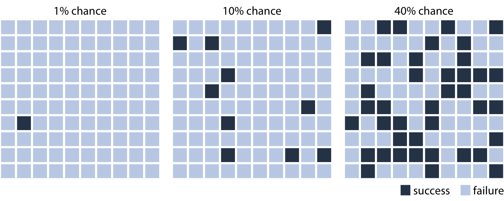
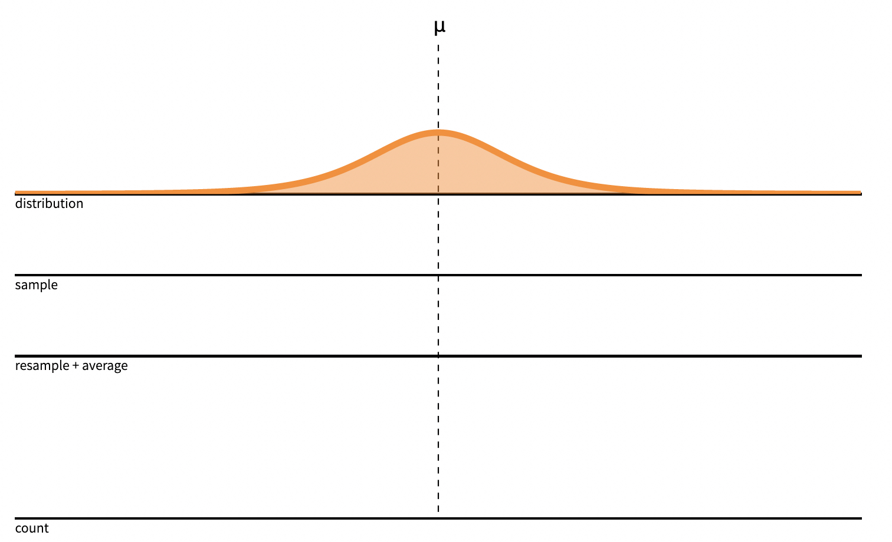

```{r meta, echo=FALSE, include=FALSE}
library(metathis)
meta() %>%
  meta_general(
    description = "Uncertainty visualizations for improving data science decision-making",
    generator = "xaringan and remark.js"
  ) %>% 
  meta_name("github-repo" = "wesslen/uncc-uncertainty") %>% 
  meta_social(
    title = "Uncertainty visualizations for improving data science decision-making",
    url = "uncc-frontiers-uncertainty.netlify.app",
    #image = "https://pkg.garrickadenbuie.com/drake-intro/assets/images/drake-intro-cover.jpg",
    #image_alt = "The first slide of the Reproducible Data Workflows with drake presentation, featuring the drake hex logo and neatly ordered row of items on a desk (eraser, pencil, coffee cup, paperclips).",
    og_type = "website",
    og_author = "Ryan Wesslen",
    twitter_card_type = "summary_large_image",
    twitter_creator = "@ryanwesslen"
  )
```


```{r xaringanExtra-freezeframe, echo=FALSE}
#xaringanExtra::use_freezeframe()
xaringanExtra::use_tachyons()
xaringanExtra::use_scribble()
```

```{r xaringan-themer, include = FALSE}
#devtools::install_github("gadenbuie/xaringanthemer")
#devtools::install_github("ropenscilabs/icon")
library(xaringanthemer); library(tidyverse); library(vembedr); library(xaringanExtra)
xaringan::summon_remark(to = "libs")
style_mono_accent(base_color = "#43418A")

#options(htmltools.preserve.raw = FALSE)
extra_css <- list(
  ".red"   = list(color = "red"),
  ".small" = list("font-size" = "70%"),
  ".large" = list("font-size" = "120%"),
  ".xlarge" = list(
    "font-size" = "250%",
    "vertical-align" = "middle" ),
  ".full-width" = list(
    display = "flex",
    width   = "100%",
    flex    = "1 1 auto"
  ),
  # ".remark-slide-content:after" = list(
  #   "content" = "'bit.ly/vis-uncertainty'",
  #   "position" = "absolute",
  #   "font-size" = "0.8em",
  #   "bottom" = "5px",
  #   "right" = "10px",
  #   "height" = "40px",
  #   "width" = "250px"
  # ),
  ".remark-slide-number" = list(
    "color" = "#FFFFFF",
    "opacity" = "1"
  )
)
# 
# div.my-footer {
#     background-color: #1a1917;
#     position: absolute;
#     bottom: 0px;
#     left: 0px;
#     height: 20px;
#     width: 100%;
# }
# 
# div.my-footer span {
#     font-size: 10pt;
#     color: #F7F8FA;
#     position: absolute;
#     left: 15px;
#     bottom: 2px;
# }

# <style type="text/css">
# .remark-slide-content {
#     font-size: 20px;
#     padding: 1em 4em 1em 4em;
# }
# </style>

#write_extra_css(css = extra_css, outfile = "custom.css")
```

```{r setup, include=FALSE}
options(htmltools.dir.version = FALSE)
knitr::opts_chunk$set(warning = FALSE, message = FALSE, 
  comment = NA, dpi = 300, echo = FALSE,
  fig.align = "center", out.width = "80%", cache = TRUE)
```

layout: true

<div class="my-footer"><span>bit.ly/vis-uncertainty</span></div>

---

# Introduction 

#### Day job: Bank of America

* Lead natural language processing (NLP) team

* Chief Data Scientist Organization, Enterprise Data Strategy & Governance

--

#### This presentation: UNC Charlotte Ribarsky Center and School of Data Science

* [20+ peer reviewed publications](https://scholar.google.com/citations?user=F40SbCkAAAAJ&hl=en) with 20+ UNCC research collaborators

* Human-computer interaction, visual analytics, information visualization, computational social science, cognitive science, psychology

* Taught Spring/Fall 2019 DSBA5122 Visual Analytics ([dsba5122.com](https://dsba5122.com))

* Collaborators: [Wenwen Dou](https://webpages.uncc.edu/~wdou1/), [Alireza Karduni](https://www.karduni.com/), [Doug Markant](http://www.markantlab.org/)

The views expressed herein are those of the presenter; they do not necessarily reflect the views of author's employer or any other group or individual.

???

[wesslen.netlify.app](wesslen.netlify.app)

---

class: center, middle

background-image: url("./img/uncertainty.png")
background-position: center
background-size: contain

???

From COVID-19 to gamestop stocks to suez canal

* these unexpected events foster uncertainty

---

class: center, middle, inverse

# Why is uncertainty often ignored in data analysis?

---

# Data Journalism


---

# Data Analytics

[point estimate -- averages]

---

# Data Science


[Sebastian Ruder](https://ruder.io/state-of-transfer-learning-in-nlp/)

---


class: center, middle, inverse

# Can better uncertainty representations enable better decision-making?

---


[Xiaoying Pu](https://www.notion.so/0c7c890ee6e44ac3886b28842c515df2?v=f5de2064ed60483da033f036de7ab52f)

Recent advances in communicating uncertainty in the fields **human-computer interaction** and **information visualizations** provide opportunities to better incorporate uncertainty into data science for better decision-making on the data.

---

```{r height=9,width=8}
magick::image_read_pdf("./img/vis.pdf",
                       pages = 1)

#magick::image_rotate(img, degrees=90)
```

---

# Talk outline

- Probabilities are hard => frequency framing

- Error bars are not enough => HOPs

- Classical statistics (like p values or CI's) are confusing => cognitive categories 

- Non-parametric => bootstrapping

- Bayesian analysis 

- Recent research in UNCC's Ribarsky Center for Visual Analytics

---

class: center, middle, inverse

# Probabilities are hard

---

class: center, middle


[Justin Gross (Washington Post)](https://www.washingtonpost.com/news/monkey-cage/wp/2016/11/29/how-to-better-communicate-election-forecasts-in-one-simple-chart/?noredirect=on&utm_term=.aa4aba18cf7b)

???

Uncertainty

* Knightian Uncertainty

* Entropy / information theory

* Frequentist: p-value, NHST

Decision-making: "choice between two or more competing courses of action" (Balleine, 2007 and Padilla et al., 2020)

argument: rise of visualization / hci best way to communicate uncertainty in data science (see padilla et al)

Choose dual-process framework: type 1 and type 2

People are very good at ignoring uncertainty... but it's especially true when we provide bad uncertainty representations" - Matthew Kay https://youtu.be/E1kSnWvqCw0

---

class: center, middle


[Justin Gross (Washington Post)](https://www.washingtonpost.com/news/monkey-cage/wp/2016/11/29/how-to-better-communicate-election-forecasts-in-one-simple-chart/?noredirect=on&utm_term=.aa4aba18cf7b)


---

# Frequency framing



[Claus Wilke](https://clauswilke.com/dataviz/visualizing-uncertainty.html)

---


[What Do Vaccine Efficacy
Numbers Actually Mean?
By Carl Zimmer and Keith Collins
March 3, 2021](https://www.nytimes.com/interactive/2021/03/03/science/vaccine-efficacy-coronavirus.html)

---

class: center, middle, inverse

# Error bars are not enough

---

How likely is it that B will be greater than A if many more draws are taken?
.pull-left[

]

--
.pull-right[

]

[UW Interactive Data Lab](https://medium.com/hci-design-at-uw/hypothetical-outcomes-plots-experiencing-the-uncertain-b9ea60d7c740)

<!-- Hullman, Resnick and Adar (2015); Padilla, Hullman, and Kay (2020)  -->

---


--

.pull-left[

]
.pull-right[

]

[UW Interactive Data Lab (Alex Kale and Jessica Hullman)](https://medium.com/@uwdata/hypothetical-outcome-plots-hops-help-users-separate-signal-from-noise-870d4e2b75d7)

---

class: center, middle, inverse

# Classical uncertainty measurements are confusing

---


[Claus Wilke](https://clauswilke.com/dataviz/visualizing-uncertainty.html)

???

* uniform distribution?

* within bar bias? ()

* what if non-normal? [Correll & Gleicher, 2014](https://graphics.cs.wisc.edu/Papers/2014/CG14/Preprint.pdf)

* dichomotomous thinking

---

# Dichomotous thinking

[insert image of why p-values can lead to dichomtomous thinking]

---

# Cognitive categories


---

# Hurricane forecasting


Liu et al.; Padilla, Hullman, and Kay (2020) 

---

class: center, middle, inverse

# Bootstrapping

---

# Assumptions

.pull-left[
Classic frequentist

* parametric

* xxx

* xxx
]
.pull-right[

Bootstrapping

* non-parametric

* focus on effect size

* xxxx

]

---

class: center, middle



---

class: center, middle


---

class: center, middle


---

class: center, middle


---

class: center, middle


---

class: center, middle


<!-- --- -->

<!-- class: center, middle -->

<!--  -->

<!-- -- -->

<!--  -->

---

class: center, middle, inverse

# Bayesian analysis

> “When my information changes, I alter my conclusions. What do you do, sir?" - John Maynard Keynes


---

class: center, middle


"Father of Intelligence Analysis"

---
class: center, middle


[Barclay et al., 1977](https://files.eric.ed.gov/fulltext/ED153329.pdf)

---

class: center, middle


Pherson

---
class: center, middle


???

Bayesian analysis assesses the uncertainty of the hypothesis in light of the observed data, and a frequentist analysis assesses the uncertainty of the observed data in light of an assumed hypothesis.

https://www.bayesrulesbook.com/chapter-1.html#thinking-like-a-bayesian
---

class: center, middle


[The Economist](https://projects.economist.com/us-2020-forecast/president/how-this-works)

---

class: center, middle


[The Economist](https://projects.economist.com/us-2020-forecast/president/how-this-works)

---

class: center, middle
<div align="center"> <blockquote class="twitter-tweet"><p lang="en" dir="ltr">One useful mental model for statistics: every bit of certainty you achieve has to either be earned with data or bought with assumptions, and you don’t often know how much the assumptions have cost you.</p>&mdash; Sean J. Taylor (@seanjtaylor) <a href="https://twitter.com/seanjtaylor/status/1369170496655220740?ref_src=twsrc%5Etfw">March 9, 2021</a></blockquote> <script async src="https://platform.twitter.com/widgets.js" charset="utf-8"></script> </div>

---

class: middle, center, inverse

# Active research

---

# Bayesian cognitive modeling


Karduni, Markant, Wesslen, and Dou (InfoVis 2020); 
Wesslen, Markant, Karduni and Dou (VisPsych 2020 workshop)

???

Bayesian cognitive modeling provide a normative benchmark for how beliefs should change depending on the strength of the evidence and participants’ uncertainty. 

For instance, a person who is confident that variables are negatively correlated may only shift their beliefs a small amount after seeing a dataset with a positive sample correlation. 

A second person who is highly uncertain about the relationship, however, may be more strongly influenced by the same data and report posterior beliefs that are closely matched to the sample correlation. 

This framework also allows us to identify when people systematically fail to adjust their beliefs as predicted by the Bayesian model.


---

# Uncertainty in identifying misinformation


Karduni, Wesslen, Markant, and Dou (In Review; ACM CSCW 2021)

---

# Myopic loss aversion


Wesslen, Karduni, Markant, and Dou (In Review; IEEE Vis 2021)

---

# Myopic loss aversion


Wesslen, Karduni, Markant, and Dou (In Review; IEEE Vis 2021)


---

# Myopic loss aversion


Wesslen, Karduni, Markant, and Dou (In Review; IEEE Vis 2021)


---

# Myopic loss aversion


Wesslen, Karduni, Markant, and Dou (In Review; IEEE Vis 2021)


---

# Key takeaways

1. xxxx

2. xxxx

3. xxxx

---

# Thank you and questions!

Resources for learning more about uncertainty visualizations

* References: [Matthew Kay](http://www.mjskay.com/), [Jessica Hullman](http://users.eecs.northwestern.edu/~jhullman/), [Lace Padilla](http://space.ucmerced.edu/home), [Claus Wilke](https://clauswilke.com/) among others!

.pull-left[
# Packages / tools

* Bootstrapping: `rsample`

* Bayesian: `rstan` + `tidybayes`, `brms`, `pymc3` 

* Uncertainty: `ggdist`

]

.pull-right[
# References

* paper 1

* paper 2

* paper 3
]

